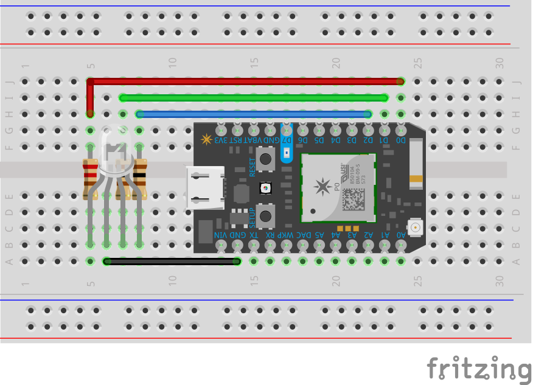

# RGB-PHOTON-SLIDER

## WebApp:
3 Sliders control RGB levels with visual feedback. Submit sends data to particle api.

## Device:
Listens for rgb values to send to particle.io Photon.

The fritzing digram shows how it should look after assembly

## Web Interface

## Diagram

