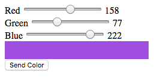

# RGB-PHOTON-SLIDER

## Web Interface:
3 Sliders control RGB levels with visual feedback. Submit sends data to particle api.

## Device:
Listens for rgb values to send to particle.io Photon.

The fritzing digram shows how it should look after assembly.

### Setup
- Flash the device code to your device.
- Add your AccessToken and DeviceId to `webapp/rgb-photon.js`
- Web Interface can run locally, no server required.
